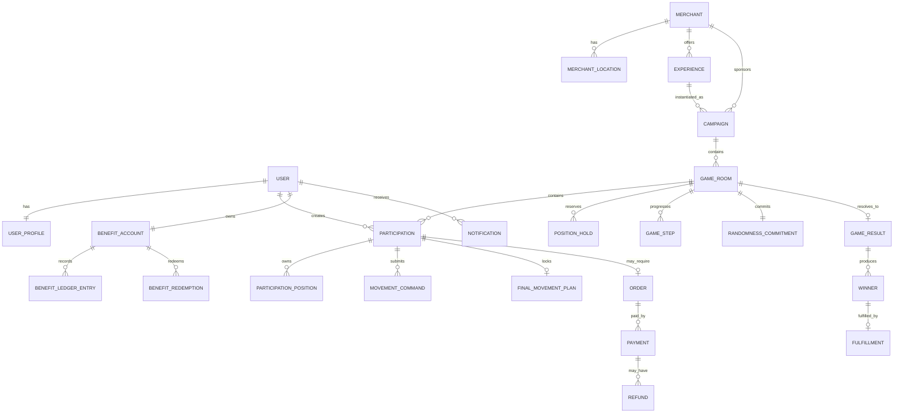
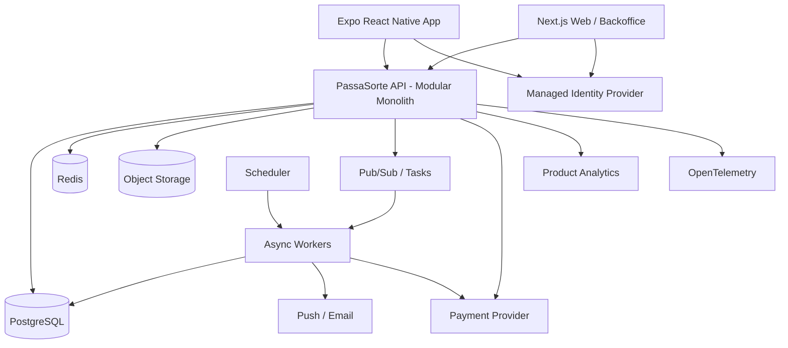

# PASSASORTE

> **Engineering & Product Constitution**
>
> This file is the primary source of truth for product, architecture and engineering decisions in the PassaSorte repository.
>
> **Priority:** Business correctness > Product clarity > Simplicity > Security > Maintainability > Scalability > Performance > Premature optimization.

---

## Status Legend

Throughout this document:

- **FACT** — explicitly defined or clearly established in the PassaSorte product history.
- **ASSUMPTION** — recommended product/technical decision introduced to make implementation coherent. May be revised through an ADR or explicit product decision.
- **TBD** — unresolved decision. Claude must not silently invent an answer.
- **LEGAL GATE** — implementation or activation depends on formal legal/compliance approval.

When a new explicit product decision conflicts with this document, the newest explicit decision wins and this file must be updated.

---

# 1. Product Overview

## 1.1 Short Description

**PassaSorte is a mobile-first platform that connects consumers with businesses through gamified access to products, services and experiences.**

A business can offer an attractive experience — such as a party, dinner, event, product, membership or service — and PassaSorte wraps that offer in an interactive game mechanic.

Instead of simply choosing a number and waiting for a result, participants occupy positions inside a game territory, monitor their proximity to a moving concept called **Sorte**, receive a personalized **temperature**, and make strategic **movements** throughout the round.

The product combines:

**Positioning + Temperature + Movement + Time Pressure + Experience + Commerce.**

The business receives customer acquisition, visibility, engagement and potential consumption.

The consumer receives entertainment, access to desirable experiences and, potentially, benefits within the PassaSorte ecosystem.

---

## 1.2 Product Definition

**FACT**

PassaSorte must not be positioned merely as a digital raffle application.

The broader product vision is:

> A marketplace of gamified experiences connecting consumers and businesses.

The commercial experience is a fundamental element of the product.

Examples of experiences contemplated in the product history include:

- party for dozens of people;
- barbecue and draft beer experience;
- restaurant experiences;
- apparel;
- gym memberships;
- event access;
- services;
- travel;
- electronics;
- vouchers;
- products from local businesses.

---

## 1.3 Core Product Promise

**FACT**

The primary mechanic can be summarized as:

> **A sorte passa. Você decide onde estar.**

A secondary commercial positioning explored for PassaSorte is:

> **A sorte passa. A experiência fica.**

These phrases are product concepts, not mandatory final marketing copy.

---

## 1.4 Problem for Consumers

Consumers frequently encounter traditional promotions, raffles and giveaways that provide almost no interaction beyond:

1. enter;
2. receive a number;
3. wait;
4. win or lose.

PassaSorte intends to transform that passive waiting period into an interactive experience involving:

- ownership of positions;
- proximity feedback;
- strategic decisions;
- live evolution;
- suspense;
- final commitment;
- result reveal.

---

## 1.5 Problem for Businesses

Small and medium businesses often depend on:

- discounts;
- paid advertising;
- social media reach;
- traditional promotions;
- coupons;
- low-differentiation campaigns.

PassaSorte intends to give those businesses a new acquisition and engagement channel by transforming products and experiences into interactive campaigns.

The value delivered to a partner may include:

- customer acquisition;
- brand exposure;
- registrations/leads;
- campaign engagement;
- store traffic;
- benefit redemption;
- repeat purchases;
- customer data where legally permitted;
- measurable campaign performance.

---

## 1.6 Main Ecosystem

The conceptual flywheel is:

```text
BUSINESS
   ↓
EXPERIENCE
   ↓
PASSASORTE
   ↓
USERS
   ↓
ENGAGEMENT / CONSUMPTION
   ↓
BUSINESS VALUE
   ↓
MORE BUSINESSES
   ↓
MORE EXPERIENCES
   ↓
MORE USERS
```

---

## 1.7 Initial Commercial Motion

**FACT**

The initial commercial model envisioned is not dependent on self-service merchant acquisition.

PassaSorte can proactively approach businesses, structure the offer with them and operate the campaign.

Therefore:

- merchant self-service is not required for the first MVP;
- a strong internal backoffice is required;
- merchant onboarding can initially be assisted/manual.

---

## 1.8 Commercial Model

**FACT**

The intended economic model includes PassaSorte monetizing campaigns and/or the commercial ecosystem.

Potential revenue sources discussed include:

- campaign/platform revenue;
- technology/operation fee;
- commercial exposure;
- partner revenue;
- ecosystem revenue;
- marketing services.

**TBD — HIGH**

The exact financial arrangement between:

- participant;
- PassaSorte;
- merchant;
- payment provider;
- prize/experience cost;
- benefits/cashback;
- taxes;
- fees;

has not been finalized.

No financial split, fee, take rate, commission or settlement formula may be invented by Claude.

---

## 1.9 Paid Participation and Regulatory Status

**FACT**

The product history includes scenarios where a participant pays to enter a campaign.

Examples such as R$1 and R$30 have been discussed.

These numbers are examples, not global constants.

**LEGAL GATE — CRITICAL**

The legal structure for paid participation, prizes, chance, game mechanics, promotions, raffles, cashback, promotional benefits and merchant campaigns must be formally validated before a production business model using those mechanisms is activated.

The system architecture must support the desired product but **must not encode an assumption that paid participation is legally permitted**.

Production feature flags related to paid promotional participation must default to disabled until formally approved.

---

## 1.10 Core Actors

The ecosystem includes at least:

1. Participant.
2. Business/merchant partner.
3. PassaSorte operations.
4. PassaSorte administrator.
5. Support.
6. Finance/settlement operator.
7. Compliance operator.
8. External providers.
9. Automated game engine.
10. Notification infrastructure.
11. Payment provider, if financial operations are activated.

---

# 2. Product Principles

## 2.1 Experience First

PassaSorte should feel like an experience platform, not a spreadsheet of raffle numbers.

## 2.2 Strategic Participation

Users should make meaningful decisions. The central product idea is not "choose a number and wait", but "choose where to be, observe what is happening, and decide how to react."

## 2.3 Temperature Is a First-Class Experience

The temperature indicator is one of the defining mechanics. It must be immediate, visual, personalized and understandable without explanation.

## 2.4 Controlled Uncertainty

The participant should have precise knowledge of their own game state while potentially having incomplete information about other participants.

## 2.5 Fairness Must Be Demonstrable

Any game result involving randomness must be generated server-side, immutable once committed, reproducible for audit, versioned, resistant to administrator manipulation and traceable.

## 2.6 Server Is Authoritative

The client must never be authoritative for game state, positions, movements, result, payment, benefit balance, eligibility or campaign timing.

## 2.7 Mobile First

Participant-facing UX must be mobile-first.

## 2.8 Low Friction

Discovery should be possible before authentication.

## 2.9 Local Commerce Value

Businesses are not merely prize suppliers. PassaSorte should generate measurable commercial value.

## 2.10 Auditability Over Convenience

Critical operations must favor correctness over convenience.

## 2.11 Configuration Over Hard-Coding

Claude must not hard-code examples such as 100 positions, 4 quadrants, 500 participants, R$30, 10 rounds, 3 final moves or specific thresholds.

## 2.12 Product Language

Prefer: entrar, participar, posição, território, movimento, sorte, temperatura, rodada, experiência.

Avoid unnecessarily positioning the product around aposta, apostador or cassino.

## 2.13 Things That Would Disfigure PassaSorte

Do not turn PassaSorte into a generic raffle list, lottery clone, static number picker, coupon directory, casino lobby, or a game where strategy has no real effect.

---

# 3. Personas & Actors

## 3.1 Anonymous Visitor

Can discover and read public campaigns, merchants, FAQ and legal content, but cannot participate or manage account data.

## 3.2 Authenticated Participant

Can manage account, join campaigns, choose positions, use movements, monitor temperature, lock strategy, follow result, receive benefits, redeem eligible benefits and contact support.

## 3.3 Merchant Partner

Provides experiences, fulfillment and business context. Merchant self-service is not mandatory for MVP.

## 3.4 Merchant Operator

Future role for redemption validation, campaign information and fulfillment confirmation.

## 3.5 PassaSorte Operator

Operates merchants, experiences, campaigns and rooms but cannot manipulate committed outcomes or immutable history.

## 3.6 PassaSorte Administrator

Manages users, roles, feature configuration and platform administration.

## 3.7 Support Agent

Can inspect users and participation context but cannot change winners or ledger history.

## 3.8 Finance Operator

Can inspect payments, refunds, reconciliation and settlement.

## 3.9 Compliance Administrator

Controls legal/compliance gates and regulated feature activation.

## 3.10 Game Engine

Authoritative internal actor for state transitions, Sorte, temperature, movement validation and results.

## 3.11 Payment Provider

External financial provider. Frontend redirects are never authoritative confirmations.

## 3.12 Notification Provider

External providers for push, email and future WhatsApp/SMS.

---

# 4. Complete User Journeys

## 4.1 Discover an Experience

Trigger: user opens PassaSorte.

Happy path:

1. Load public campaign catalog.
2. Show active/upcoming experiences.
3. User opens campaign.
4. Show experience, merchant, status, timing, participation mechanism and mandatory conditions.

Recovery: retry or safe cached public data.

## 4.2 Sign Up

1. User chooses signup.
2. Identity verified.
3. Required profile data collected.
4. Legal acknowledgements accepted.
5. Account/session created.
6. Return user to original intent.

## 4.3 Login

Use secure identity flow, validate server-side, establish session, return to intended destination.

## 4.4 Access Recovery

Use provider-supported recovery and avoid user enumeration.

## 4.5 Enter a Campaign

1. Validate campaign and eligibility.
2. Select room if applicable.
3. Select positions.
4. Select/receive movements.
5. Create temporary hold.
6. Complete participation requirement/payment if applicable.
7. Confirm participation.
8. Commit positions.

## 4.6 Select Positions

Server returns authoritative board. User selects valid positions. Server creates atomic hold. Concurrent losses must be recoverable.

## 4.7 Checkout and Payment

**LEGAL GATE**

Order → payment intent → provider → verified webhook → captured payment → confirmed participation.

Frontend success is never payment confirmation.

## 4.8 Follow Live Game

Display own positions, movements, Sorte, temperature, countdown and phase from authoritative server state.

## 4.9 Submit a Movement

Validate phase, ownership, allowance, timing, idempotency and game rules before accepting a movement.

## 4.10 Final Strategy Lock

User builds and confirms remaining movement sequence. Once accepted, it is immutable.

## 4.11 Result

Engine resolves final state, persists result transactionally and notifies participants.

## 4.12 Winner Fulfillment

Winner notification → eligibility check → fulfillment record → merchant/PassaSorte action → completion.

## 4.13 Receive Benefits

Benefit rule → immutable ledger credit → visible balance/expiration.

## 4.14 Redeem Benefit

Verify balance, eligibility, merchant, expiration and single-use token, then atomically redeem.

## 4.15 Notifications

Support participation, game, result, winner, benefit, cancellation and refund notifications.

## 4.16 Support

Create contextual support cases linked to campaign/participation where relevant.

## 4.17 Merchant Onboarding

Operator creates merchant, locations, experience and fulfillment information.

## 4.18 Create Campaign

Merchant/experience → campaign metadata → rooms → game rules → timing → compliance → preview → approval → publication.

## 4.19 Cancel Campaign

Stop entries, preserve history, notify users, execute required refund/benefit recovery and audit.

## 4.20 Logout

Clear local credentials and revoke server/provider session where appropriate.

## 4.21 Delete Account

Delete/anonymize allowed data while retaining mandatory financial/audit records according to law.

---

# 5. Functional Requirements

## Identity & Account

- **FR-001 User Registration:** create exactly one validated user and record legal acceptance versions.
- **FR-002 Authentication:** establish secure session only after valid authentication.
- **FR-003 Logout:** invalidate current session.
- **FR-004 Access Recovery:** secure recovery without enumeration.
- **FR-005 User Profile:** manage permitted profile fields.
- **FR-006 Account Deletion:** LGPD-compatible deletion/anonymization workflow.

## Discovery

- **FR-007 Campaign Catalog:** paginated public campaigns with future filters.
- **FR-008 Campaign Detail:** complete mandatory campaign information.
- **FR-009 Merchant Public Profile:** merchant and active experiences.

## Merchant & Experience

- **FR-010 Merchant Management:** backoffice create/update/activate/deactivate merchants.
- **FR-011 Merchant Locations:** one-to-many merchant locations.
- **FR-012 Experience Management:** define experience and snapshot it at campaign publication.

## Campaigns

- **FR-013 Campaign Creation:** create drafts.
- **FR-014 Campaign Configuration:** configure merchant, experience, media, eligibility, timing, rooms and participation mode.
- **FR-015 Campaign Approval:** validate before publication.
- **FR-016 Campaign Publication:** publish only approved campaigns.
- **FR-017 Campaign Cancellation:** authorized cancellation with reason and audit.

## Rooms & Board

- **FR-018 Multiple Rooms:** a campaign may have multiple rooms.
- **FR-019 Room Capacity:** finite configured capacity.
- **FR-020 Configurable Board:** board size must not be hard-coded.
- **FR-021 Quadrants/Regions:** configurable logical regions.
- **FR-022 Position Availability:** authoritative server availability.
- **FR-023 Position Selection:** contiguous or scattered selections.
- **FR-024 Atomic Position Hold:** concurrency-safe hold.
- **FR-025 Hold Expiration:** auto-release expired holds.
- **FR-026 Position Commitment:** commit only after requirements complete.

## Participation

- **FR-027 Participation Creation:** canonical participation record per entry.
- **FR-028 Eligibility Validation:** server-side.
- **FR-029 Participation Package:** configurable positions, movements and price/eligibility.
- **FR-030 Participation Confirmation:** confirm only after all conditions.

## Game

- **FR-031 Versioned Game Engine**
- **FR-032 Frozen Game Configuration**
- **FR-033 Authoritative Sorte State**
- **FR-034 Personalized Temperature**
- **FR-035 Movement Allowance**
- **FR-036 LEFT/RIGHT Movement**
- **FR-037 Movement Validation**
- **FR-038 Idempotent Movement Submission**
- **FR-039 Final Lock**
- **FR-040 Immutable Final Strategy**
- **FR-041 Automatic Round Evolution**
- **FR-042 Server-Side Result Resolution**
- **FR-043 Immutable Winner Persistence**
- **FR-044 Game Replay for Audit**

## Temperature

- **FR-045 Distance Calculation**
- **FR-046 Temperature Classification**
- **FR-047 Exact Distance Visibility as configurable non-MVP feature**

## Payments

- **FR-048 Payment Order**
- **FR-049 Payment Intent**
- **FR-050 Async Payment Confirmation**
- **FR-051 Payment Idempotency**
- **FR-052 Refund**
- **FR-053 Payment Reconciliation**

## Benefits

- **FR-054 Promotional Benefit Grant**
- **FR-055 Benefit Ledger**
- **FR-056 Benefit Expiration**
- **FR-057 Benefit Redemption**
- **FR-058 Redemption Replay Protection**

## Notifications

- **FR-059 In-App Notifications**
- **FR-060 Push Notifications**
- **FR-061 Email Notifications**
- **FR-062 Notification Preferences**

## Backoffice

- **FR-063 Backoffice Authentication**
- **FR-064 Campaign Operations**
- **FR-065 User Search**
- **FR-066 Participation Inspection**
- **FR-067 Financial Inspection**
- **FR-068 Game Audit Viewer**
- **FR-069 Audit Log Viewer**
- **FR-070 Feature Flags**
- **FR-071 Legal/Compliance Gate**
- **FR-072 Support Cases**

---

# 6. Business Rules

- **BR-001:** Campaign is the commercial container.
- **BR-002:** Every commercial campaign references a merchant and experience snapshot.
- **BR-003:** Campaign can contain multiple rooms.
- **BR-004:** Every room has finite capacity.
- **BR-005:** Board size is configurable.
- **BR-006:** Position number is room-scoped.
- **BR-007:** User may own multiple positions.
- **BR-008:** Positions need not be contiguous.
- **BR-009:** ASSUMPTION: MVP uses exclusive board positions.
- **BR-010:** Position race must be atomic.
- **BR-011:** Hold is not ownership.
- **BR-012:** Sorte is modeled as a zone/range.
- **BR-013:** Sorte zone width is configurable.
- **BR-014:** Player distance is minimum distance between active participant positions and Sorte range.
- **BR-015:** Temperature derives from normalized distance.
- **BR-016:** Temperature bands are configurable, not hard-coded.
- **BR-017:** Temperature is personalized.
- **BR-018:** Exact player state is private.
- **BR-019:** Live occupancy may be hidden subject to legal disclosure obligations.
- **BR-020:** Movement allowance is finite and cannot go negative.
- **BR-021:** MVP movement directions include LEFT and RIGHT.
- **BR-022:** Exact movement effect is TBD.
- **BR-023:** ASSUMPTION for simulation only: PLAYER_TRANSLATION_V1.
- **BR-024:** Game engine version/config are immutable per active room.
- **BR-025:** Server clock is authoritative.
- **BR-026:** Game steps are sequence-numbered.
- **BR-027:** Final phase threshold is configurable.
- **BR-028:** Final sequence is immutable.
- **BR-029:** Missing final submission behavior is TBD.
- **BR-030:** Randomness should be cryptographically committed and reproducible.
- **BR-031:** Administrator cannot replace committed seed.
- **BR-032:** Winner calculation is server-side.
- **BR-033:** Winner semantics are TBD.
- **BR-034:** Paid participation is a LEGAL GATE.
- **BR-035:** Money uses integer minor units.
- **BR-036:** Provider/backend confirm payments, never frontend.
- **BR-037:** Financial commands are idempotent.
- **BR-038:** Benefits are non-withdrawable/non-transferable until explicitly approved otherwise.
- **BR-039:** Benefit balance derives from immutable ledger.
- **BR-040:** Internal campaign economics remain private unless disclosure is required.
- **BR-041:** Internal economics must be measurable.
- **BR-042:** Progressive pricing is NOT MVP.
- **BR-043:** Participation spend limit is TBD.
- **BR-044:** Exact-distance bonus is COULD HAVE.
- **BR-045:** Cancellation is terminal.
- **BR-046:** Critical history is immutable.
- **BR-047:** Persist timestamps in UTC and store campaign IANA timezone.
- **BR-048:** ASSUMPTION: MVP locale pt-BR and BRL.

---

# 7. State Machines

## Campaign

```text
DRAFT -> IN_REVIEW -> APPROVED -> SCHEDULED -> PUBLISHED -> ENDED
          \______________________________________________> CANCELLED
```

## Game Room

```text
DRAFT -> OPEN -> ENTRY_LOCKED -> RUNNING -> FINAL_LOCK -> RESOLVING -> COMPLETED
  \________________________________________________________________> CANCELLED
```

## Participation

```text
CREATED -> RESERVED -> AWAITING_REQUIREMENT -> CONFIRMED -> ACTIVE -> LOCKED -> RESOLVED -> WON/NOT_WON -> COMPLETED
```

## Payment

```text
CREATED -> PENDING -> AUTHORIZED -> CAPTURED -> REFUND_PENDING -> REFUNDED
                   \-> FAILED
                   \-> CANCELLED
CAPTURED -> CHARGEBACK
```

## Benefit

```text
GRANTED -> AVAILABLE -> REDEEMED
                    \-> EXPIRED
                    \-> REVERSED
```

## Fulfillment

```text
PENDING -> CONTACTED -> SCHEDULED -> FULFILLED
                       \-> CANCELLED
                       \-> EXCEPTION
```

---

# 8. Domain Model

Core entities:

```text
User
UserProfile
Merchant
MerchantLocation
Experience
Campaign
GameRoom
BoardPosition
PositionHold
Participation
ParticipationPosition
MovementAllocation
MovementCommand
FinalMovementPlan
GameStep
RandomnessCommitment
GameResult
Winner
Fulfillment
Order
Payment
Refund
BenefitAccount
BenefitLedgerEntry
BenefitRedemption
Notification
NotificationPreference
SupportCase
AuditLog
OutboxEvent
WebhookEvent
FeatureFlag
```



---

# 9. UX / UI Architecture

Participant UI must be mobile-first, visual, low-friction, game-like without casino mimicry and explicit about irreversible actions.

Recommended navigation:

```text
Home
Experiências
Minhas Participações
Benefícios
Perfil
```

MVP screens include public home/catalog, campaign detail, auth, room/position selection, summary, conditional checkout, participations, live game, final lock, result, benefits, notifications, profile, support and administrative backoffice.

Primary flow:

```text
Home
→ Campaign Detail
→ Participate
→ Login/Signup
→ Room
→ Position Selection
→ Summary
→ Checkout if applicable
→ Confirmation
→ Live Game
→ Final Lock
→ Result
→ Fulfillment/Benefits
```

Temperature must never depend only on color.

---

# 10. System Architecture



Initial backend is one deployable modular monolith.

PostgreSQL is source of truth.

Redis is cache/rate-limit/transient state only.

Async processing handles notifications, webhooks, reconciliation, game progression, result publication, expiration and cleanup.

Start realtime with SSE or controlled polling; add WebSockets only when justified.

---

# 11. Architectural Strategy

Use:

> **Modular Monolith + Domain-Oriented Modules + Ports/Adapters + Transactional Outbox**

Bounded contexts:

```text
Identity
Partner
Catalog
Campaign
Game
Participation
Commerce
Benefits
Fulfillment
Notifications
Support
Compliance
Audit
Analytics
```

Pure domain code must not depend on Prisma, HTTP, cloud SDKs or provider SDKs.

Use synchronous application interfaces inside the monolith and domain events for async side effects.

Critical DB mutation + async side effect must use transactional outbox.

---

# 12. Scalability Strategy

## Stage 1 — 0–10k

1 API, 1 worker tier, managed PostgreSQL, Redis, object storage, CDN, managed auth.

## Stage 2 — 10k–100k

Horizontal API/workers, connection pooling, stronger caching, queue separation, SSE fanout improvements and autoscaling.

## Stage 3 — 100k–1M

Read replicas, partition large append-only tables, isolate game workloads, denormalized read models, Redis cluster, dedicated realtime and stronger anti-bot controls.

## Stage 4 — 1M+

Evaluate regional deployment, partitioning/sharding, extracted Game Engine service, event streaming and multi-region read models based on measured bottlenecks.

Do not implement Stage 4 complexity in MVP.

---

# 13. Recommended Technology Stack

**ASSUMPTIONS unless later confirmed**

- Language: TypeScript
- Mobile: React Native + Expo
- Web/Backoffice: Next.js + React
- Backend: NestJS + Fastify
- Database: PostgreSQL
- ORM: Prisma, with selective raw SQL for advanced locking/index cases
- Validation: Zod
- Authentication: managed OIDC/Firebase Authentication or equivalent
- Storage: Google Cloud Storage
- Queue: Google Cloud Pub/Sub + Cloud Tasks
- Cache: Redis / Memorystore
- Analytics: PostHog
- Observability: OpenTelemetry + Google Cloud Monitoring/Logging; Sentry optional
- Testing: Vitest/Jest, API integration tooling, Playwright, Testcontainers
- CI/CD: GitHub Actions
- Cloud: Google Cloud Platform
- IaC: Terraform

---

# 14. Repository Architecture

```text
/
├── apps/
│   ├── api/
│   ├── worker/
│   ├── mobile/
│   └── web/
├── packages/
│   ├── domain/
│   ├── application/
│   ├── api-contract/
│   ├── config/
│   ├── observability/
│   ├── analytics/
│   └── testkit/
├── infrastructure/
│   ├── terraform/
│   └── docker/
├── prisma/
│   ├── schema.prisma
│   └── migrations/
├── docs/
│   ├── adr/
│   ├── product/
│   ├── security/
│   ├── runbooks/
│   └── api/
├── scripts/
├── tests/
├── CLAUDE.md
├── package.json
├── pnpm-workspace.yaml
└── turbo.json
```

Use pnpm. Use Turborepo if orchestration becomes useful.

---

# 15. Database Architecture

Use UUID public IDs, preferably UUIDv7 where stable.

Core tables:

```text
users
user_profiles
roles
user_roles
merchants
merchant_locations
experiences
campaigns
game_rooms
position_holds
position_hold_items
participations
participation_positions
movement_allocations
movement_commands
final_movement_plans
game_steps
randomness_commitments
game_results
winners
fulfillments
orders
payments
refunds
payment_webhook_events
benefit_accounts
benefit_ledger_entries
benefit_redemptions
notifications
notification_preferences
support_cases
support_case_events
compliance_approvals
audit_logs
outbox_events
feature_flags
```

Mandatory transaction boundaries include position commit, participation confirmation, movement consumption, final lock, result, benefit redemption, finance and outbox creation.

Never manually change production schema.

---

# 16. API Architecture

Use REST JSON under `/api/v1`.

Global error format:

```json
{
  "error": {
    "code": "POSITION_UNAVAILABLE",
    "message": "A posição selecionada não está mais disponível.",
    "requestId": "req_...",
    "details": {}
  }
}
```

Use cursor pagination.

Require idempotency keys for critical commands.

Core endpoints include:

```text
GET /api/v1/campaigns
GET /api/v1/campaigns/{id}
GET /api/v1/merchants/{id}
GET /api/v1/me
GET /api/v1/me/participations
POST /api/v1/rooms/{id}/position-holds
POST /api/v1/participations
POST /api/v1/participations/{id}/checkout
GET /api/v1/rooms/{id}/state
POST /api/v1/participations/{id}/movements
POST /api/v1/participations/{id}/final-plan
GET /api/v1/me/benefits
POST /api/v1/benefit-redemptions
```

Backoffice APIs must cover merchants, experiences, campaigns, rooms, users, payments, refunds, audit and game audit.

---

# 17. Authentication & Authorization

Use managed identity plus internal RBAC.

Roles:

```text
PARTICIPANT
MERCHANT_OPERATOR
SUPPORT
OPERATOR
FINANCE
COMPLIANCE
ADMIN
```

Privileged roles require MFA in production.

Never allow any role to directly modify immutable winner or ledger history.

---

# 18. Security Architecture

Apply least privilege, deny by default, server-side authorization, immutable critical history, secret isolation and privileged-action audit.

Threats to handle:

- broken access control;
- SQL injection;
- XSS;
- CSRF;
- credential stuffing;
- enumeration;
- replay;
- bots;
- API abuse;
- admin compromise.

Use TLS, KMS/Secret Manager, security headers, SAST, dependency scans and secret scans.

---

# 19. LGPD & Privacy

Potential PII includes name, email, phone, address, birth date and identifiers.

Financial data includes payment status and provider references but never full card data.

Technical/behavioral data includes IP, device, application version, logs and product analytics.

Minimize collection, document purpose and define retention before production.

Account deletion must distinguish erasable profile data from legally required immutable transaction/audit records.

---

# 20. Analytics Architecture

Analytics is mandatory from day one.

Recommended North Star:

> **Weekly Completed Participations (WCP)**

Business KPIs:

- active merchants;
- campaigns launched/completed;
- repeat merchant rate;
- participants;
- revenue/net revenue when applicable;
- contribution margin;
- refund/payment failure rates;
- benefit redemption;
- fulfillment.

Product KPIs:

- campaign view;
- participation start;
- position selection;
- confirmed participation;
- live game return;
- movement usage;
- final plan submission;
- result view;
- repeat participation.

Event naming:

```text
object_action
```

Core events:

```text
app_opened
campaign_list_viewed
campaign_viewed
campaign_shared
signup_started
signup_completed
login_completed
participation_started
room_selected
position_selection_started
position_selected
position_deselected
position_hold_created
position_hold_failed
checkout_started
payment_succeeded
payment_failed
participation_confirmed
live_game_viewed
temperature_viewed
movement_submitted
movement_accepted
movement_rejected
final_plan_started
final_plan_submitted
game_result_viewed
prize_won
fulfillment_started
fulfillment_completed
benefit_granted
benefit_viewed
benefit_redemption_started
benefit_redeemed
notification_opened
support_case_created
account_deletion_requested
```

Never send passwords, tokens, card data or unnecessary PII to analytics.

---

# 21. Product Funnels

Discovery funnel:

```text
campaign_viewed
↓
participation_started
↓
position_selection_started
↓
position_hold_created
↓
checkout_started [if applicable]
↓
payment_succeeded [if applicable]
↓
participation_confirmed
```

Game funnel:

```text
participation_confirmed
↓
live_game_viewed
↓
movement_accepted
↓
final_plan_submitted
↓
game_result_viewed
```

Benefits funnel:

```text
benefit_granted
↓
benefit_viewed
↓
benefit_redemption_started
↓
benefit_redeemed
```

---

# 22. Experimentation & Feature Flags

Use flags for paid participation, benefits, occupancy display, exact distance, temperature thresholds, engine version, final lock, onboarding and movement UX.

Critical kill switches:

```text
ENABLE_NEW_PARTICIPATIONS
ENABLE_PAID_PARTICIPATION
ENABLE_MOVEMENTS
ENABLE_GAME_AUTO_ADVANCE
ENABLE_BENEFIT_REDEMPTION
ENABLE_PAYMENT_CAPTURE
```

---

# 23. Logging Strategy

All backend logs are structured JSON with at least:

```text
timestamp
level
service
environment
requestId
correlationId
userId when safe
operation
durationMs
errorCode
```

Never log passwords, tokens, secrets, raw card data, sensitive provider payloads, game secret seed before reveal or unnecessary PII.

---

# 24. Observability

Use logs, metrics and traces through OpenTelemetry.

Monitor API latency/errors, DB latency/connections, queue depth, failed jobs, game step lag, movement rejection, game resolution duration, payment webhook lag and reconciliation mismatches.

---

# 25. SLO / SLI

Initial targets:

```text
Availability >= 99.9% monthly
Read API p95 < 500 ms
Critical command p95 < 750 ms
5xx rate < 0.5%
99% scheduled game steps within 5s of intended timestamp
95% transactional notifications handed to provider within 60s
```

---

# 26. Error Handling

Categories:

```text
DomainError
ValidationError
AuthorizationError
ConflictError
InfrastructureError
IntegrationError
UnexpectedError
```

Never expose stack traces.

Unexpected errors must return request ID.

---

# 27. Resilience

Every external call has timeout.

Retry only safe/idempotent operations with exponential backoff and jitter.

Use circuit breakers where dependency instability can cascade.

Async handlers must tolerate duplicate delivery and support DLQ.

---

# 28. Background Jobs

Expected jobs:

```text
expire_position_holds
open_scheduled_campaigns
close_campaign_entries
advance_game_step
enter_final_lock
resolve_game
publish_game_result
send_notifications
expire_benefits
reconcile_payments
process_payment_webhook
process_outbox_event
generate_campaign_metrics
detect_stuck_rooms
cleanup_expired_tokens
```

---

# 29. Notifications

Architecture:

```text
Domain Event
→ Transactional Outbox
→ Queue
→ Notification Worker
→ Provider
```

MVP channels: in-app, push, email.

Future: WhatsApp, SMS.

---

# 30. Integration Architecture

Use ports/adapters for payment, identity, notifications and analytics.

External failures must not corrupt core domain state.

---

# 31. Webhooks

Webhook flow:

```text
Receive
→ Verify signature
→ Validate timestamp
→ Persist event metadata
→ Enforce provider-event idempotency
→ Process
```

Protect against replay and duplicate delivery.

---

# 32. Payments / Financial Operations

**LEGAL GATE**

Payment provider is TBD and must sit behind a `PaymentGateway` port.

Flow:

```text
Participation Reservation
→ Order
→ Payment Intent
→ Provider
→ Verified Webhook
→ Payment Captured
→ Participation Confirmed
```

Reconciliation must detect provider/internal divergence.

---

# 33. Fraud & Abuse Prevention

Threats include:

- multiple accounts;
- bots;
- position sniping;
- movement replay;
- payment fraud;
- admin result manipulation;
- fake webhooks;
- benefit reuse;
- API scraping.

Prefer provider-native fraud capabilities before custom ML.

Critical result integrity uses engine versioning, committed randomness, KMS, state hashes and audit.

---

# 34. Audit Trail

Audit records are append-only and separate from application logs.

Mandatory audit actions include privileged logins, role changes, merchant changes, campaign approval/publication/cancellation, room config, compliance approval, seed commitment, result, refunds, benefit adjustments, fulfillment override and feature flag changes.

---

# 35. Caching

Safe cache candidates: public catalog, merchant profile, static experience content, media URLs and non-authoritative read models.

Never use cache as sole source of truth for positions, movements, payments, benefit balance, winner or compliance.

---

# 36. Performance Requirements

Initial targets:

```text
Mobile useful content < 3 seconds target
API read p95 < 500ms
Critical commands p95 < 750ms
Common indexed DB queries p95 < 100ms under expected Stage 1 load
```

Use pagination, indexes, CDN, lazy loading, compression, responsive images and connection pooling.

---

# 37. Non-Functional Requirements

- **NFR-001:** Core API availability >= 99.9%.
- **NFR-002:** 95% core reads < 500ms.
- **NFR-003:** 95% critical commands < 750ms excluding provider latency.
- **NFR-004:** Duplicate payment webhooks never duplicate business effects.
- **NFR-005:** Game replay is deterministic.
- **NFR-006:** 100% defined critical privileged operations generate audit.
- **NFR-007:** 100% external production traffic uses TLS.
- **NFR-008:** No production secret in repository.
- **NFR-009:** Target WCAG 2.2 AA.
- **NFR-010:** 100% backend requests receive request ID.
- **NFR-011:** Critical async flows propagate correlation ID.
- **NFR-012:** Production deployment automated via CI/CD/IaC.
- **NFR-013:** Application rollback does not require manual code edits.
- **NFR-014:** Managed DB supports automated backup/PITR.
- **NFR-015:** Initial RPO <= 15 minutes.
- **NFR-016:** Initial RTO <= 4 hours.
- **NFR-017:** Pure Game Engine runs without cloud/database.
- **NFR-018:** Stateless APIs scale horizontally.
- **NFR-019:** Mobile API preserves supported backward compatibility window.
- **NFR-020:** No sensitive credential/payment data in logs.
- **NFR-021:** Critical external consumers tolerate duplicate delivery.
- **NFR-022:** 99% scheduled game transitions within 5 seconds.
- **NFR-023:** Domain modules do not import infrastructure from other modules.
- **NFR-024:** New engineer can boot local dependencies from documented commands.
- **NFR-025:** Restore test at least quarterly after launch.

---

# 38. Accessibility

Target WCAG 2.2 AA.

Support keyboard, focus, screen readers, contrast, labels, reduced motion, accessible errors and mobile touch targets.

Temperature must include text meaning in addition to visual color/icon.

---

# 39. Testing Strategy

Use a pyramid emphasizing unit/domain and integration tests.

Mandatory focus:

- temperature;
- positions;
- movement allowance;
- final lock;
- state machines;
- result;
- benefit ledger;
- idempotency;
- position concurrency.

Property-based tests are recommended for game invariants.

Concurrency test must prove only one valid confirmed ownership for an exclusive position.

Selected E2E must cover participation, game, result and conditional payment flows.

---

# 40. Test Data

Use factories, fixtures, deterministic game seeds and synthetic identities.

Never use real production customer data.

Standard seed scenarios should include draft/open campaigns, normal/final game phase, completed game, payment states and benefit states.

---

# 41. CI/CD

```text
Commit / PR
→ Install locked dependencies
→ Lint
→ Typecheck
→ Unit/Domain Tests
→ Integration Tests
→ Build
→ Security Scan
→ Deploy Preview/Staging
→ Smoke Tests
→ Approval
→ Production
→ Post-deploy Checks
```

---

# 42. Environments

Minimum:

```text
local
development
staging
production
```

Use typed configuration and never hard-code business behavior based solely on `NODE_ENV`.

---

# 43. Infrastructure as Code

Use Terraform for Cloud Run, Cloud SQL, Redis, queues, storage, secrets references, monitoring and related infrastructure.

Production infrastructure changes go through PR.

---

# 44. Backups & Disaster Recovery

Initial recommendation:

```text
daily managed backup
continuous PITR
retention >= 7 days
RPO <= 15 minutes
RTO <= 4 hours
```

Restore testing quarterly after production launch.

---

# 45. Database Migration Strategy

Every schema change is versioned.

Never edit an already-applied production migration.

Use expand/contract for risky changes and avoid destructive rollback dependencies.

---

# 46. Coding Standards

Always:

- prefer simple code;
- use strict TypeScript;
- use explicit domain naming;
- avoid magic values;
- centralize business rules;
- keep functions focused;
- separate domain from infrastructure;
- validate boundaries;
- avoid circular dependencies;
- avoid `any`;
- prefer composition;
- keep provider SDK types out of domain;
- never access DB directly from UI;
- never trust client-computed price/result;
- document non-obvious invariants.

---

# 47. AI Coding Guardrails

Before implementing any feature Claude must:

1. read relevant CLAUDE.md section;
2. identify FACT / ASSUMPTION / TBD;
3. inspect current module;
4. inspect related tests;
5. inspect API contracts;
6. evaluate DB impact;
7. evaluate security;
8. evaluate analytics;
9. evaluate observability;
10. evaluate backward compatibility;
11. identify domain events;
12. implement smallest correct change;
13. add/update tests;
14. run quality checks.

Claude must not invent rules, resolve TBDs silently, rewrite unnecessarily, duplicate architecture, bypass domain boundaries, weaken authorization, remove tests, use `any` to silence errors, swallow exceptions, expose secrets, alter historical migrations, mutate immutable records, trust client state or introduce microservices without an ADR.

---

# 48. Definition of Done

A feature is complete only when applicable:

- requirement implemented;
- acceptance criteria satisfied;
- business rules preserved;
- validation added;
- authorization verified;
- security reviewed;
- analytics added;
- logs/metrics/audit added;
- tests passing;
- lint/typecheck passing;
- migrations added;
- API/documentation updated;
- feature flags configured;
- no secret exposed;
- accessibility considered;
- rollback considered;
- alerts added if critical.

---

# 49. Git Strategy

Use trunk-oriented GitHub flow.

Branches:

```text
main
feature/<short-name>
fix/<short-name>
chore/<short-name>
```

Use Conventional Commits.

---

# 50. Dependency Management

Use the minimum necessary dependencies, prefer mature libraries, keep lockfile committed, scan vulnerabilities and upgrade deliberately.

Do not add packages for trivial helpers.

---

# 51. Feature Development Workflow

```text
Understand
↓
Design
↓
Implement
↓
Instrument
↓
Test
↓
Review
↓
Deliver
```

---

# 52. MVP Scope

## MUST HAVE

Public campaign discovery, campaign detail, account, merchants/experiences, campaign backoffice, room, configurable board, position selection/hold, confirmed participation, versioned game engine, Sorte, temperature, movements, final lock, automated result, winner persistence, notifications, fulfillment tracking, support basics, PostgreSQL, API, auth, RBAC, audit, outbox, workers, analytics, logging, metrics, CI/CD, IaC, backups and feature flags.

Payments are conditional on approved legal/commercial model.

## SHOULD HAVE

Push, in-app notifications, merchant reporting, PassaBenefícios, redemption, support tooling, sharing, location filtering, game replay viewer and result proof UI.

## COULD HAVE

Player archetypes, achievements, rankings, exact-distance bonus, multiple engine styles, referrals, merchant portal, WhatsApp/SMS and advanced fraud scoring.

## NOT NOW

Microservices, Kubernetes, Kafka, service mesh, multi-region active-active, custom fraud ML, cryptocurrency, transferable wallet, open merchant marketplace, social network/chat or speculative Stage 4 architecture.

---

# 53. Implementation Roadmap

## Phase 0 — Foundation

Repository, CLAUDE.md, ADRs, monorepo, local DB/cache, CI, config, observability.

## Phase 1 — Identity + Partner + Campaign

Auth, users, RBAC, merchants, experiences, campaigns, backoffice and catalog APIs.

## Phase 2 — Game Domain Simulator

Pure engine interface, deterministic prototype, board, Sorte, temperature, positions, movement, final lock and replay fixtures.

## Phase 3 — Participation & Concurrency

Rooms, positions, holds, participation, eligibility and movement allocation.

## Phase 4 — Participant Mobile Journey

Home, campaign, auth, position selection, confirmation, live game, final lock and result.

## Phase 5 — Scheduled Game Operations

Scheduler, workers, state progression, result resolution, notifications and operational dashboard.

## Phase 6 — Compliance & Financial Integration

Only after legal/commercial decision.

## Phase 7 — Benefits

Benefit account, ledger, grant, expiration and redemption if included in launch.

## Phase 8 — Analytics & Production Hardening

Dashboards, alerts, SLOs, security review, load test, DR and runbooks.

## Phase 9 — Pilot Launch

Controlled merchants, limited rooms, strong monitoring and daily product review.

---

# 54. Initial Engineering Backlog

```text
TASK-001 Initialize Monorepo
TASK-002 Configure Quality Toolchain
TASK-003 Create CI Pipeline
TASK-004 Local Infrastructure
TASK-005 Configuration Module
TASK-006 Structured Logging
TASK-007 Request/Correlation IDs
TASK-008 OpenTelemetry Bootstrap
TASK-009 Database Schema Foundation
TASK-010 Authentication Adapter
TASK-011 RBAC
TASK-012 Merchant Domain
TASK-013 Experience Domain
TASK-014 Campaign Domain
TASK-015 Campaign Backoffice
TASK-016 Public Campaign Catalog API
TASK-017 GameEngine Interface
TASK-018 Game Configuration Schema
TASK-019 Temperature Domain
TASK-020 Randomness Commitment Prototype
TASK-021 Game Simulator
TASK-022 Resolve Movement Algorithm
TASK-023 Implement Game Engine V1
TASK-024 Room Domain
TASK-025 Participation Domain
TASK-026 Position Hold
TASK-027 Position Concurrency Tests
TASK-028 Movement Allocation
TASK-029 Movement Commands
TASK-030 Final Movement Plan
TASK-031 Game Result Engine
TASK-032 Winner Model
TASK-033 Outbox Worker
TASK-034 Scheduler
TASK-035 Notification Infrastructure
TASK-036 Mobile Application Shell
TASK-037 Mobile Home
TASK-038 Campaign Detail
TASK-039 Mobile Auth
TASK-040 Position Selection UI
TASK-041 Participation Confirmation UI
TASK-042 Live Game UI
TASK-043 Final Lock UI
TASK-044 Result UI
TASK-045 Product Analytics SDK
TASK-046 Core Funnel Events
TASK-047 Game Operational Dashboard
TASK-048 Audit Viewer
TASK-049 Support Search
TASK-050 Legal/Compliance Gate
TASK-051 PaymentGateway Interface
TASK-052 Select Payment Provider
TASK-053 Payment Integration
TASK-054 Payment Webhooks
TASK-055 Payment Reconciliation
TASK-056 Refund Flow
TASK-057 Benefit Ledger
TASK-058 Benefit Redemption
TASK-059 Security Hardening
TASK-060 Rate Limiting
TASK-061 Privileged MFA
TASK-062 Load Tests
TASK-063 Backup/PITR Validation
TASK-064 Production IaC
TASK-065 Staging Environment
TASK-066 Production Deployment Pipeline
TASK-067 SLO Dashboards
TASK-068 Operational Alerts
TASK-069 End-to-End Pilot Simulation
TASK-070 Production Readiness Review
```

---

# 55. Key Architectural Decisions

| ADR     | Decision                            | Status            |
| ------- | ----------------------------------- | ----------------- |
| ADR-001 | TypeScript                          | PROPOSED          |
| ADR-002 | Monorepo                            | PROPOSED          |
| ADR-003 | Modular monolith                    | ACCEPTED STRATEGY |
| ADR-004 | PostgreSQL                          | PROPOSED          |
| ADR-005 | REST/OpenAPI                        | PROPOSED          |
| ADR-006 | Expo React Native                   | PROPOSED          |
| ADR-007 | Next.js backoffice/web              | PROPOSED          |
| ADR-008 | Managed identity                    | PROPOSED          |
| ADR-009 | GCP managed runtime                 | PROPOSED          |
| ADR-010 | Transactional outbox                | PROPOSED          |
| ADR-011 | Versioned GameEngine                | ACCEPTED STRATEGY |
| ADR-012 | Deterministic committed randomness  | PROPOSED          |
| ADR-013 | Redis not source of truth           | ACCEPTED STRATEGY |
| ADR-014 | Payment provider abstraction        | PROPOSED          |
| ADR-015 | Benefit ledger                      | PROPOSED          |
| ADR-016 | SSE before WebSocket                | PROPOSED          |
| ADR-017 | Exclusive positions in MVP          | PROPOSED          |
| ADR-018 | Exact movement effect               | TBD               |
| ADR-019 | Winner-selection semantics          | TBD               |
| ADR-020 | Paid participation production model | TBD               |

---

# 56. Open Questions / TBD

## Business — HIGH

- exact revenue model;
- merchant agreement;
- experience funding;
- settlement;
- platform fee;
- benefit funding;
- cancellation/refund/chargeback economics.

## Product — CRITICAL

- what exactly does a movement move?
- winner semantics;
- multi-winner behavior;
- empty winning-zone behavior;
- final position exclusivity.

## Product — HIGH

- final-lock timing;
- missing final submission;
- multiple participations;
- position/movement package model;
- participation limits;
- occupancy visibility.

## UX — HIGH

- board interaction;
- Sorte visualization;
- state visibility;
- final-lock interaction;
- reaction windows;
- tutorial strategy.

## Technical — HIGH

- auth provider;
- payment provider;
- final realtime transport;
- exact engine V1;
- hold TTL.

## Legal/Compliance — CRITICAL

- legal characterization;
- permitted campaign structure;
- required authorization/disclosures;
- age restrictions;
- prize rules;
- refunds/cancellation;
- winner publication;
- cashback/benefit treatment;
- tax treatment;
- merchant responsibility.

---

# 57. Risks

Key risks include legal viability, ambiguous game semantics, poor game comprehension, double-allocation races, admin manipulation, payment duplication/outage, bots, multi-account abuse, chargebacks, merchant fulfillment failure, trust issues around occupancy, over-gambling visual language, realtime overengineering, premature microservices, PII leakage, wallet-like benefit risk, scheduler lag, stale clients and result disputes.

Mitigate through legal gates, deterministic simulation, transactions, idempotency, KMS, audit, rate limits, managed providers, server authority and replayable game state.

---

# 58. Things Claude Must Never Assume

Claude must never invent:

- participation price;
- prize value;
- platform margin;
- merchant cost/settlement;
- board size;
- quadrant count;
- room capacity;
- occupancy disclosure;
- movement quantity/price/effect;
- Sorte algorithm;
- winner rule/count/ties;
- cancellation/refund behavior;
- benefit percentage/expiration;
- eligibility/minimum age;
- authentication method;
- legal authorization;
- tax treatment;
- payment provider;
- withdrawability/transferability of benefits;
- retention duration;
- marketing consent.

When uncertain:

```text
check latest explicit product decision
→ check CLAUDE.md
→ check ADR
→ check tests/contracts
→ preserve configurability
→ document TBD
```

---

# 59. Source of Truth Hierarchy

1. Newest explicit decision from product owner/user.
2. Current CLAUDE.md.
3. Accepted ADRs.
4. Approved automated tests.
5. Public API/schema contracts.
6. Existing implementation.
7. Comments.

Existing code is not automatically correct if it contradicts newer product decisions.

---

# 60. Claude Code Operating Instructions

You are working on **PassaSorte**.

Treat this `CLAUDE.md` as the product and engineering constitution of the project.

Before any significant implementation:

1. identify bounded context;
2. identify FACTs;
3. identify ASSUMPTIONs;
4. identify TBDs;
5. inspect code and tests;
6. analyze transactions;
7. analyze DB/API;
8. analyze authorization/security/fraud;
9. analyze analytics/observability;
10. analyze backward compatibility;
11. only then implement.

> **Never optimize only for "making it work". Optimize for correctness, simplicity, security, maintainability and evolvability.**

Game rule changes must consider engineVersion, gameConfigSnapshot, replay and active rooms.

Finance must never trust frontend confirmation, floating point money or mutable historical ledgers.

Architecture must not add microservices, databases, brokers, frameworks or cloud products without demonstrated need.

---

# 61. Self-Review Checklist

Before materially changing this file verify:

```text
[x] Business is understandable.
[x] PassaSorte remains distinct from a simple raffle.
[x] Positioning, Temperature, Movement and Experience are represented.
[x] Merchant value is represented.
[x] Rooms and configurable boards are represented.
[x] Personalized temperature is represented.
[x] Final strategy lock is represented.
[x] Information asymmetry is represented.
[x] Legal uncertainty is explicit.
[x] Payments are server authoritative.
[x] Game logic is isolated and versioned.
[x] Movement ambiguity is explicit.
[x] Winner ambiguity is explicit.
[x] Journeys, requirements and business rules are documented.
[x] Architecture, security, analytics and observability are included.
[x] Fraud, LGPD and audit are included.
[x] Scalability path avoids premature complexity.
[x] NFRs are measurable.
[x] Backlog and roadmap are incremental.
[x] Claude knows what it must never assume.
```

---

# Final Product Constitution

The architectural center of PassaSorte is the combination of:

```text
EXPERIENCE
+
PARTICIPATION
+
POSITIONING
+
TEMPERATURE
+
MOVEMENT
+
TIME
+
FAIR RESULT
+
BUSINESS VALUE
```

Everything must preserve four properties:

```text
1. The participant understands what is happening.
2. The game result can be trusted and audited.
3. The business obtains measurable value.
4. The platform can evolve without rewriting its foundations.
```

When simplicity conflicts with speculative scalability:

> choose simplicity.

When implementation convenience conflicts with financial/game correctness:

> choose correctness.

When growth conflicts with trust:

> choose trust.

When a business rule is unknown:

> do not invent it.

When a product rule changes:

> version or migrate it deliberately.

When an external provider can fail:

> assume it eventually will.

When the client and server disagree:

> the server wins.

When existing code and the newest explicit product decision disagree:

> the newest explicit product decision is the source of truth.
